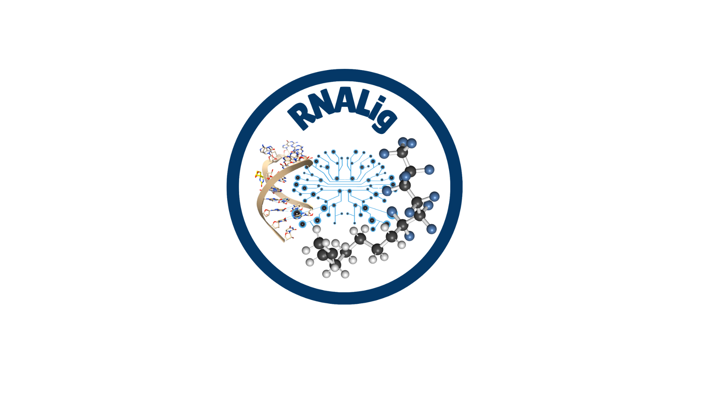

  

<h1 align="center">RNALigGUI</h1>

  <b>RNA–Ligand Binding Affinity Prediction and MD Trajectory Analysis Platform</b>

  <a href="https://rnalig-gui.streamlit.app">🌐 Web Server</a>

---

## Overview

RNALigGUI is a web-based platform for RNA–ligand binding affinity prediction and molecular dynamics (MD) trajectory analysis using the RNALig machine-learning framework. The platform provides an intuitive graphical interface for predicting RNA–ligand binding free energies and analyzing conformational ensembles generated from molecular dynamics simulations.

In addition to single-structure prediction, RNALigGUI supports batch processing of trajectory frames through ZIP-file uploads, enabling users to investigate the temporal evolution of RNA–ligand interactions throughout MD simulations.

---

## Key Features

- RNA–ligand binding affinity prediction
- Support for PDB and mmCIF structures
- Batch processing of multiple trajectory frames
- ZIP file upload for MD trajectory analysis
- Frame-wise binding affinity prediction
- Averaged binding affinity estimation (RNALig_Frames)
- Interactive 3D molecular visualization
- Downloadable prediction reports
- User-friendly web interface

---

## Workflow

1. Upload an RNA–ligand complex (PDB/mmCIF) or a ZIP archive containing MD trajectory frames.
2. Automatic structure preprocessing.
3. Extraction of structural and physicochemical descriptors.
4. RNALig-based binding affinity prediction.
5. Visualization and download of prediction results.

---

## Input Formats

### Single Structure Prediction

- `.pdb`
- `.cif`

### MD Trajectory Analysis

- ZIP archive containing multiple RNA–ligand complex structures extracted from MD trajectories

---

## Output

RNALigGUI provides:

- Predicted binding free energy (ΔG)
- RNA descriptors
- Ligand descriptors
- RNA–ligand interaction features
- Frame-wise affinity predictions
- Averaged trajectory affinity estimates
- Interactive visualization
- Downloadable results

---

## Web Server

🌐 https://rnalig-gui.streamlit.app

---

## Example Applications

- RNA–ligand binding affinity prediction
- Molecular dynamics trajectory analysis
- Frame-wise affinity monitoring
- RNA–ligand stability assessment
- RNA-targeted drug discovery studies

---

## Citation

If you use RNALigGUI in your research, please cite:

Sharma P., Gupta T., Latha N., Pant P.

**RNALig Web Server: An ML-Driven Platform for RNA–Ligand Binding Affinity Prediction and MD Trajectory Analysis.**

---

## Related Resources

### RNALig

https://github.com/Computational-biolab/RNALig

### RNALig Web Server

https://rnalig-gui.streamlit.app

---

## Contact

**Priyanka Sharma**  
NextGen Computational Biology Lab  
Department of Biotechnology  
Bennett University, India

For questions or suggestions, please open an issue in this repository.

---

## License

This repository contains documentation, example files, screenshots, and user resources for RNALigGUI.
